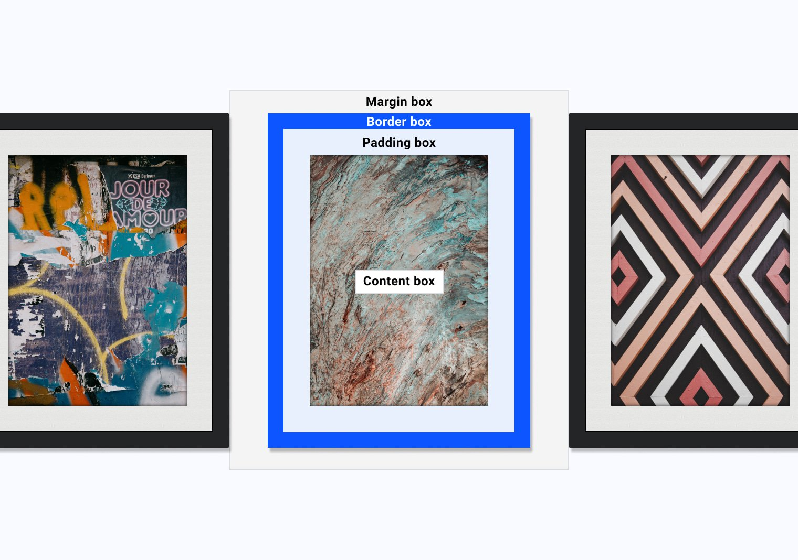

# 盒子模型

盒子模型是 CSS 的核心基础，了解它的工作原理、CSS 的其他方面对模型的影响，以及重要的是，了解如何控制该模型将有助于您编写更具预测性的 CSS。编写 CSS 时或整个 Web 平台时，请务必注意，CSS 显示的所有内容都是一个框。




## 控制框模型
`box-sizing` 它会告知浏览器如何计算其框大小。默认情况下，所有元素都具有以下用户代理样式：`box-sizing: content-box;`。
```css
*,
*::before,
*::after {
  box-sizing: border-box;
}
```