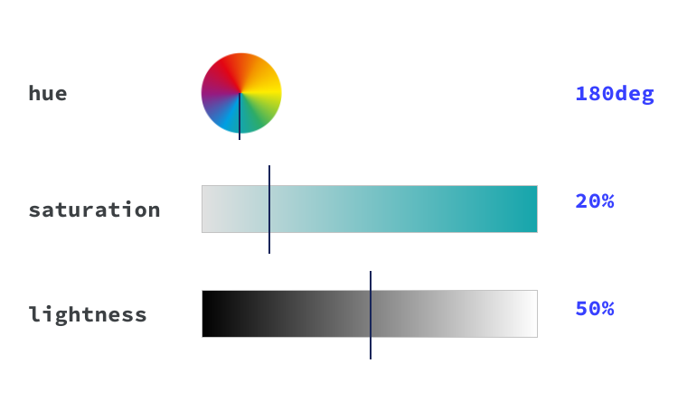

# 颜色

## 数字颜色

十六进制颜色
```
h1 {
  color: #b71540;
}
```

RGB（红、绿、蓝）
```
h1 {
  color: rgb(183, 21, 64);
}
```

HSL（色调、饱和度、亮度）
```
h1 {
  color: hsl(344, 79%, 40%);
}
```




[颜色关键字](https://developer.mozilla.org/docs/Web/CSS/color_value#color_keywords) CSS 中有 148 种已命名的颜色。例如 purple、tomato 和 goldenrod。

除了标准颜色之外，您还可以使用特殊关键字：

transparent 是一种完全透明的颜色。 它也是 background-color 的初始值。
currentColor 是 color 属性的上下文计算的动态值。如果文本颜色为 red，然后将 border-color 设置为 currentColor，它也会变为红色。如果您定义 currentColor 的元素没有为 color 定义值，系统将改为通过级联计算 currentColor

## 在 CSS 规则中的什么位置使用颜色


