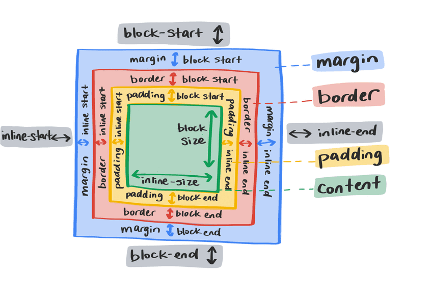

# 布局


## display 属性

display 属性会执行两项操作。它首先确定应用它所应用的框是 inline 还是块。内嵌元素的行为类似于句子中的字词。它们在内嵌方向上并排显示。 <span> 和 <strong> 等元素通常用于为所含元素（如 <p> [段落]）中的文本段设置样式，它们默认采用内嵌样式。它们还会保留周围的空白。
```
.my-element {
  display: inline;
}
```



您无法为内嵌元素设置明确的宽度和高度。周围的元素会忽略任何块级的外边距和内边距。
```
.my-element {
    display: block;
}
```

块元素不会并排放置。 他们会自行另起一行。除非被其他 CSS 代码更改，否则块元素将展开为内嵌尺寸，因此在水平书写模式下会跨越整个宽度。将采用 block 元素所有侧边的外边距。
```
.my-element {
    display: flex;
}
```
display 属性还决定了元素的子元素的行为方式。例如，将 display 属性设置为 display: flex 会使该框成为块级框，并将其子项转换为弹性项。这会启用用于控制对齐、排序和流动的灵活属性。

## Flexbox 和网格
为多个元素创建布局规则的主要布局机制是 flexbox 和 grid。它们虽然有相似之处，但旨在解决不同的布局问题。

### Flexbox
Flexbox 是一维布局的布局机制。沿单轴布局（水平或垂直）。 默认情况下，Flexbox 将在内嵌方向上彼此相邻地对齐元素的子元素，并在块方向上拉伸这些子元素，使它们的高度相同。


各项内容将保持在同一轴上，且在空间用尽时不会换行。 相反，它们会尝试各自挤入同一行。 可以使用 align-items、justify-content 和 flex-wrap 属性更改此行为。

使用 flex 属性更改其收缩方式。flex 属性是 flex-grow、flex-shrink 和 flex-basis 的简写形式。

```
.my-element div {
    flex: 1 0 auto;
}
```

### 网格
网格在很多方面与 Flexbox 类似，但其设计是为了控制多轴布局，而不是单轴布局（垂直或水平空间）。
```
.my-element {
    display: grid;
}
```

## 流式布局
如果不使用网格或 Flexbox，您的元素会以正常流程显示。在正常流程中，您可以使用多种布局方法来调整项目的行为和位置。

### 内嵌块inline-block

### 浮点数